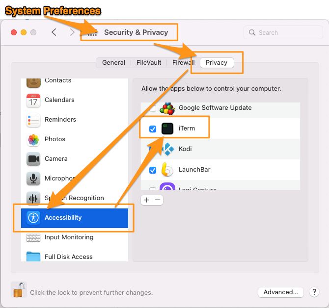

# How to simulate movement in Android Emulator and iOS Simulator

GPX files show longitude and latitude GPS co-ordinates in an XML format, timestamped at waypoints for the movements that have happened. The same file format works on both Androind and iOS (see example: /utils/wpt-parkrun-roundhay.gpx). These GPX files can be used to demonstrate movement of a person or vehicle in an app that uses maps. We use sample GPX files in Emulator apps for our Treasure Hunt.

## Android Studio App

Movement can be simulated in Android Studio by uploading a GPX file to the virtual device.

Android GPX files are in XML format. Each individual GPS waypoint needs to be recorded with a 'wpt' XML tag. The file "wpt-parkrun-roundhay.gpx" in this utils folder is a sample file format. It covers the GPS trackpoints of an anonymous person's run around Roundhay Parkrun in Roundhay, Leeds (https://www.parkrun.org.uk/roundhay/)

To upload the GPX file into your Android virtual device:

1. From the virtual device, click the three dots link at the bottom of the control menu.
2. Choose the location tab
3. Select the 'Routes' tab
4. Import your GPX file using the 'Import GPX/KML' button
5. To 'run' your GPX file, highlight the route in the right hand tab, choose the playback speed (5X is fine for a quicker demo), and click the 'Play Route' button. Android Studio steps through the GPX file trackpoints at the playback speed you've selected.

# iOS Simulator App

Movement can be simulated in the iOS Simulator app by using a GPX file to set the virtual location of the device.
This video shows the process:
https://vimeo.com/705877627/fda240ef82

iOS GPX files are also in XML format. Each individual GPS waypoint needs to be recorded with a 'wpt' XML tag. The file "wpt-parkrun-roundhay.gpx" in this utils folder is a sample file format. It covers the GPS trackpoints of an anonymous person's run around Roundhay Parkrun in Roundhay, Leeds (https://www.parkrun.org.uk/roundhay/)

At the time of writing, the iOS emulator doesn't have the capability to upload a step-by-step GPX file. You can use some pre-defined maps around Apple's HQ in Cupertino, California. But to step through a GPX file in a different location, more relevant to your testing, you need to follow the process explained in this article by Pieter Nijs, aka 'PieEatingNinjas':
https://blog.pieeatingninjas.be/2017/02/10/custom-location-and-movement-on-xamarin-remoted-ios-simulator-for-windows/

It involves running an automation script from MacOS terminal. An amended version for UK measurements is in this folder: 'GPXLocationUpdater-wpt.scpt'

To run the script, open your terminal (not a git tracked folder) and from the location you are running the script from, run the command:

osascript GPXLocationUpdater-wpt.scpt [full path to gpx file]/wpt-parkrun-roundhay.gpx 1

The script launch command is formed of 4 parts:

1. The script commmand
2. The script location (current directory)
3. The path to the GPX file (this needs the full path to the file, even if it's in the same directory)
4. Number of seconds between steps (1 second is fine for demo purposes)

On first running, Mac OS will ask you to allow terminal to have permission to run the file. Grant this in System Preferences > Security & Privacy > Privacy > Accessibility > iTerm (you will need to click the lock icon to make the changes and then lock them to confirm)

Terminal and the icon that pops up in Simulator to change the longitude / latitude co-ordinates when the script runs need to stay in the foreground of your screen as the script runs. When the script is running, you should see Simulator app's location box pop-up and change every X seconds you have set the script to run.

A link to the original terminal script is here - note that this script uses lat / long co-ordinates in European decimal place formatting (commas rather than dot decimal points, so if you're using this in UK, US or other locations with dot decimal points, then be sure to use the script in this /utils folder instead):
https://github.com/PieEatingNinjas/Auto-GPX-location-updater-iOS-simulator/blob/master/GPXLocationUpdater.scpt
